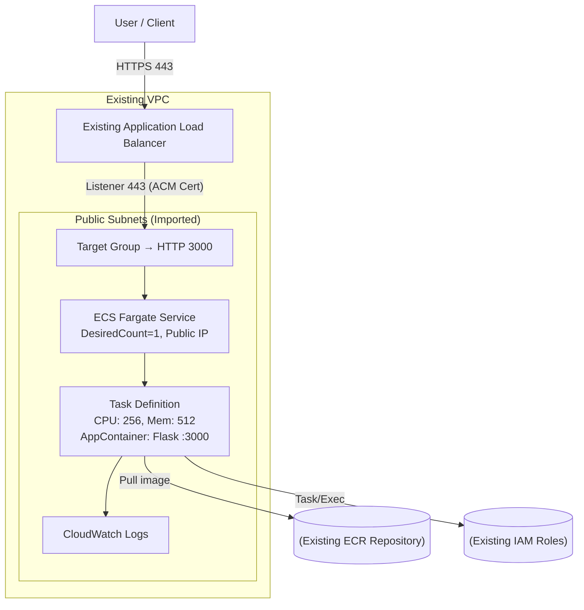

# Sample Application

This repository contains a minimal Flask application exposed via a `/healthcheck` endpoint. Dependencies are managed with [Poetry](https://python-poetry.org/) and the app is containerised with Docker for easy local development and deployment.

# Tech Stack

- Application: Python + Flask web service on port `3000`.
- Packaging: Poetry for dependency management.
- Containerization: Dockerfile and docker-compose for local development.
- Infrastructure as Code: AWS CDK (TypeScript) for ECS/Fargate + ALB wiring.
- Logging: Amazon CloudWatch Logs via ECS log driver.

## AWS Services

- ECS Fargate: Serverless container orchestration for the application.
- Networking: Existing VPC and public subnets are imported.
- Load Balancing: Existing Application Load Balancer with an HTTPS listener.
- Container Registry: Existing Amazon ECR repository for container images.
- IAM: Existing task and execution roles for the ECS task.
- TLS: Existing ACM certificate used for HTTPS termination on ALB.

## Provisioned Resources (CDK)

- ECS Cluster: Hosts the service tasks within the imported VPC (`MyAppCluster`).
- Fargate Task Definition: CPU/memory, roles, and container image/tag; CloudWatch logging enabled.
- Fargate Service: 1 desired task, public IP, deployed in specified public subnets with safe rollout settings.
- ALB HTTPS Listener (port 443): New listener on the existing ALB using the imported ACM certificate.
- Target Group + Health Check: Forwards traffic to the ECS service on port `3000` with `/healthcheck`.
- CloudWatch Logs: Managed via the ECS log driver for container logs.

## Pre-Existing (Imported) Dependencies

- VPC: Provided via `vpcId`.
- Public Subnets: Provided via `publicSubnetIds`.
- Application Load Balancer: Provided via `albArn`.
- ACM Certificate: Provided via `certificateArn`.
- ECR Repository: Provided via `ecrRepoName`.
- IAM Roles: Task and execution roles provided via ARNs.

## Runtime/Deploy Notes
- Image tag: From `IMAGE_TAG` environment variable, defaults to `latest`.
- Stage: From `ENV_STAGE` environment variable, defaults to `dev`.
- Health endpoint: `/healthcheck` returns 200 with environment and version.

## Local development

1. Copy `.env.example` to `.env` and update environment variables as needed.
2. Start the application:

```bash
docker compose up
```

## Testing

Run the unit tests inside the Docker environment:

```bash
docker compose run app poetry run pytest -s
```

## Deployment

1. Create (or confirm) an AWS ECR repository and authenticate Docker:

```bash
aws ecr create-repository --repository-name devops-test --region <region> || true
aws ecr get-login-password --region <region> | docker login --username AWS --password-stdin <account>.dkr.ecr.<region>.amazonaws.com
```

2. Build and push the Docker image:

```bash
docker build --platform linux/amd64 -t devops-test .
docker tag devops-test:latest <account>.dkr.ecr.<region>.amazonaws.com/devops-test:latest
docker push <account>.dkr.ecr.<region>.amazonaws.com/devops-test:latest
```

3. (Optional) Deploy infrastructure with AWS CDK:

```bash
cd iac
npx cdk deploy
```

## Architecture Diagram



For a larger view, see `docs/architecture.md`.
