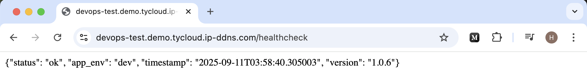
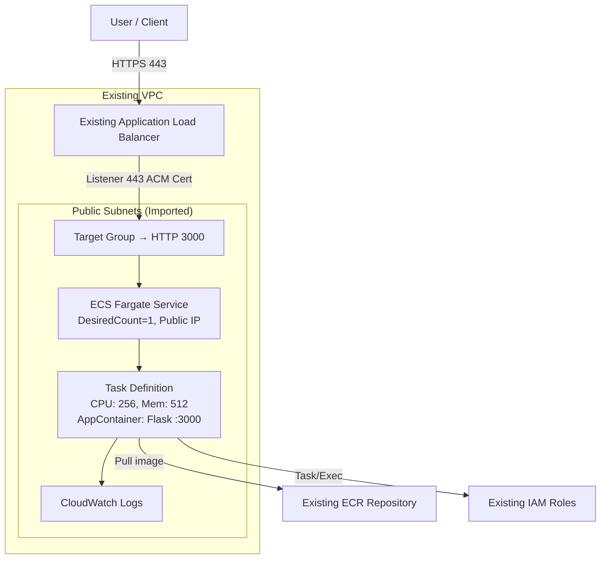
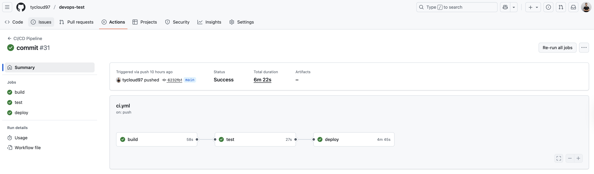
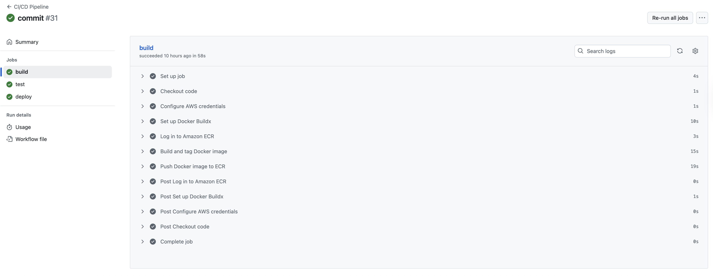
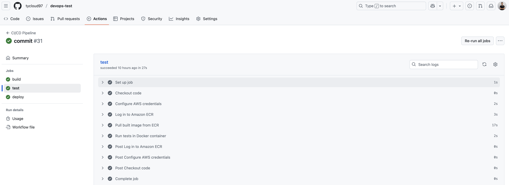
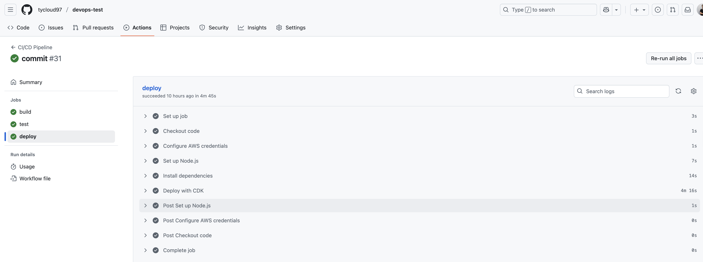
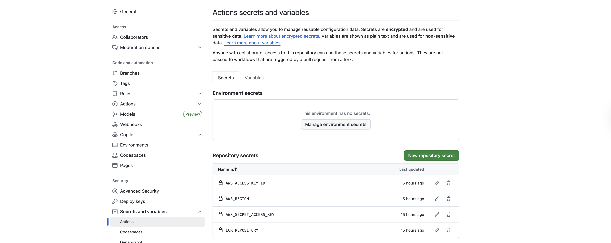

# Sample Application

This repository contains a minimal Flask application exposed via a `/healthcheck` endpoint. Dependencies are managed with [Poetry](https://python-poetry.org/) and the app is containerised with Docker for easy local development and deployment.

  

## Architecture Diagram



Notes:
- Pre-existing resources: VPC, Public Subnets, ALB, ACM Certificate, IAM Roles, ECR.
- Provisioned via CDK: ECS Cluster, Task Definition, Fargate Service, ALB HTTPS Listener + Target Group.


# Tech Stack

- Application: Python + Flask web service on port `3000`.
- Packaging: Poetry for dependency management.
- Containerization: Dockerfile and docker-compose for local development.
- Infrastructure as Code: AWS CDK (TypeScript) for ECS/Fargate + ALB wiring.
- CI/CD: GitHub Actions workflow (`.github/workflows/ci.yml`) builds, tests, and deploys via CDK.

## Provisioned Resources (CDK)

- ECS Cluster: Hosts the service tasks within the imported VPC (`MyAppCluster`).
- Fargate Task Definition: CPU/memory, roles, and container image/tag; CloudWatch logging enabled.
- Fargate Service: 1 desired task, public IP, deployed in specified public subnets with safe rollout settings.
- ALB HTTPS Listener (port 443): New listener on the existing ALB using the imported ACM certificate.
- Target Group + Health Check: Forwards traffic to the ECS service on port `3000` with `/healthcheck`.
- CloudWatch Logs: Managed via the ECS log driver for container logs.

## Pre-Existing (Imported) Dependencies

- VPC: Provided via `vpcId`.
- Public Subnets: Provided via `publicSubnetIds`.
- Application Load Balancer: Provided via `albArn`.
- ACM Certificate: Provided via `certificateArn`.
- ECR Repository: Provided via `ecrRepoName`.
- IAM Roles: Task and execution roles provided via ARNs via `taskRoleArn` and `executionRoleArn`.

## Runtime/Deploy Notes
- Image tag: From `IMAGE_TAG` environment variable, defaults to `latest`.
- Stage: From `ENV_STAGE` environment variable, defaults to `dev`.
- Health endpoint: `/healthcheck` returns 200 with environment and version.

## Local development

1. Copy `.env.example` to `.env` and update environment variables as needed.
2. Start the application:

```bash
docker compose up
```

## Testing

Run the unit tests inside the Docker environment:

```bash
docker compose run app poetry run pytest -s
```

## Deployment

1. Create (or confirm) an AWS ECR repository and authenticate Docker:

```bash
aws ecr create-repository --repository-name devops-test --region <region> || true
aws ecr get-login-password --region <region> | docker login --username AWS --password-stdin <account>.dkr.ecr.<region>.amazonaws.com
```

2. Build and push the Docker image:

```bash
docker build --platform linux/amd64 -t devops-test .
docker tag devops-test:latest <account>.dkr.ecr.<region>.amazonaws.com/devops-test:latest
docker push <account>.dkr.ecr.<region>.amazonaws.com/devops-test:latest
```

3. (Optional) Deploy infrastructure with AWS CDK:

```bash
cd iac
npm ci
npx cdk deploy
```

## CI/CD

- Trigger: Pushes to `main` run three jobs in sequence: Build → Test → Deploy.
- Image Tagging: Sets `IMAGE_TAG` to the commit SHA for traceable, immutable builds.
- Flow: Build and push Docker image to ECR → run tests using the same image → deploy CDK stack with that `IMAGE_TAG`.

  

### Build
- Purpose: Produce and publish a versioned Docker image.
- Steps:
  - Checkout repository and configure AWS credentials.
  - Set up Docker Buildx and log in to Amazon ECR.
  - Build image; tag with commit SHA (`IMAGE_TAG`) and `latest`.
  - Push both tags to ECR.
- Input: `secrets.ECR_REPOSITORY`, `AWS_*` secrets, `IMAGE_TAG`.
- Output: Image in ECR at `<ECR_REPOSITORY>:<IMAGE_TAG>` and `<ECR_REPOSITORY>:latest`.

  

### Test
- Purpose: Validate the build using the same image that will be deployed.
- Steps:
  - Checkout repository, configure AWS, log in to ECR.
  - Pull image from ECR using `IMAGE_TAG`.
  - Run `poetry run pytest -s` inside the container.
- Input: `<ECR_REPOSITORY>:<IMAGE_TAG>`.
- Output: Test results; gate for deployment.

  

### Deploy
- Purpose: Update the running service to the new image.
- Conditions: Runs only on `main` and after Test succeeds.
- Steps:
  - Checkout repository; configure AWS credentials.
  - Set up Node.js 20; install CDK and dependencies in `iac/`.
  - Deploy: `IMAGE_TAG=${GITHUB_SHA} npx cdk deploy --require-approval never`.
- Effect:
  - CDK uses `IMAGE_TAG` to update the ECS Fargate Task Definition.
  - ECS Service behind the existing ALB is refreshed; `/healthcheck` controls rollout via target group health checks.

  

### Required GitHub Secrets
- `AWS_ACCESS_KEY_ID`, `AWS_SECRET_ACCESS_KEY`, `AWS_REGION`: AWS credentials and region.
- `ECR_REPOSITORY`: Fully qualified ECR repository (e.g. `<account>.dkr.ecr.<region>.amazonaws.com/devops-test`).

  

Workflow file: `.github/workflows/ci.yml`


